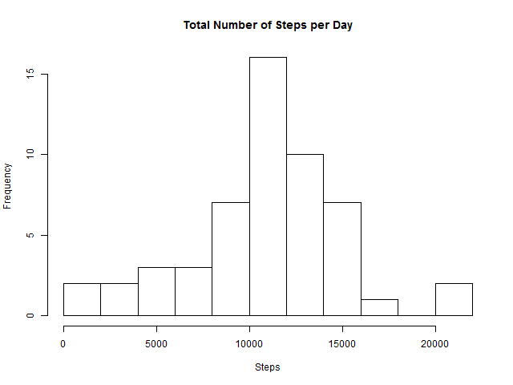
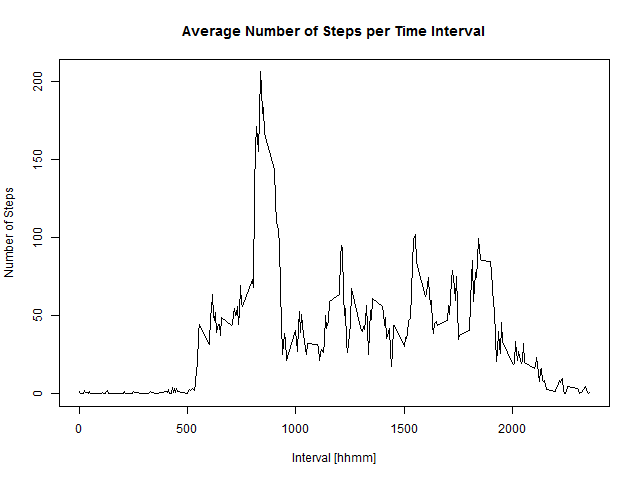
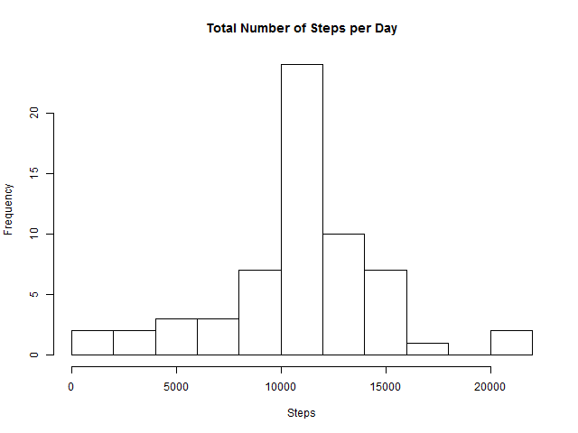
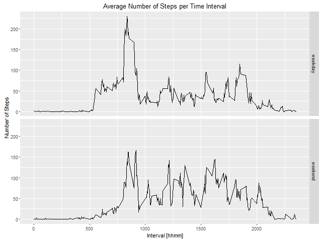

# Reproducible Research: Peer Assessment 1


## Loading and preprocessing the data

### 1. Load the data (assumes data file in working directory)

```r
raw_data <- read.csv("activity.csv", header = TRUE, sep=",")
```

### 2. Process/transform the data into a format suitable for analysis

```r
proc_data <- with(raw_data, data.frame(steps = steps, date = as.Date(date), interval = interval))
```

***
## What is mean total number of steps taken per day?

### 1. Calculate the total number of steps taken per day)

```r
day_total_steps <- with(proc_data, tapply(steps, date, sum))
```

### 2. Make a histogram of the total number of steps taken each day

```r
png(filename="figure/hist1.png", width = 640, height = 480, units = "px", pointsize = 12)
hist(day_total_steps, breaks = 10, main="Total Number of Steps per Day", xlab="Steps")
dev.off()
```
figure/hist1.png:



### 3. Calculate and report the mean and median of the total number of steps taken per day

```r
day_mean <- mean(day_total_steps, na.rm=TRUE)
day_median <- median(day_total_steps, na.rm=TRUE)
```
**Average number of steps per day is 10766.19.** (Note: This number is calculated by inline R code like `r format(round(day_mean, 2), nsmall=2)` formatting and rounding `day_mean`. I couldn't find an easy way to show inline code as it gets evaluated, so you have to see .Rmd code for the details. The note is also applicable to other numbers below.)

**Median number of steps per day is 10765.**

***
## What is the average daily activity pattern?

### 1. Make a time series plot (i.e. type = "l") of the 5-minute interval (x-axis) and the average number of steps taken, averaged across all days (y-axis)

```r
interval_mean_steps <- tapply(proc_data$steps, proc_data$interval, mean, na.rm=TRUE)
png(filename="figure/time1.png", width = 640, height = 480, units = "px", pointsize = 12)
plot(names(interval_mean_steps),interval_mean_steps, type ="l",
     main = "Average Number of Steps per Time Interval", xlab = "Interval [hhmm]", ylab ="Number of Steps")
dev.off()
```
figure/time1.png:



### 2. Which 5-minute interval, on average across all the days in the dataset, contains the maximum number of steps?

```r
names(grep(max(interval_mean_steps), interval_mean_steps, value=TRUE))
```

```
## [1] "835"
```

## Imputing missing values

### 1. Calculate and report the total number of missing values in the dataset (i.e. the total number of rows with NAs)

```r
sum(is.na(proc_data$steps))
```

```
## [1] 2304
```

### 2. Devise a strategy for filling in all of the missing values in the dataset

**Replace missing values with mean number of steps in the same interval, rounded to nearest integer.**

### 3. Create a new dataset that is equal to the original dataset but with the missing data filled in

```r
tidy_data <-proc_data
tidy_data[is.na(tidy_data$steps),]$steps <-
  round(interval_mean_steps[as.character(tidy_data[is.na(tidy_data$steps),]$interval)])
```

### 4a. Make a histogram of the total number of steps taken each day

```r
tidy_total_steps <- with(tidy_data, tapply(steps, date, sum))
png(filename="figure/hist2.png", width = 640, height = 480, units = "px", pointsize = 12)
hist(tidy_total_steps, breaks = 10, main="Total Number of Steps per Day", xlab="Steps")
dev.off()
```
figure/hist2.png:



### 4b. Calculate and report the mean and median total number of steps taken per day. Do these values differ from the estimates from the first part of the assignment?

```r
tidy_mean <- mean(tidy_total_steps)
tidy_median <- median(tidy_total_steps)
```
**Average number of steps per day is 10765.64. There is -0.01% difference from data containing NAs.**

**Median number of steps per day is 10762. There is 0.00% difference from data containing NAs.**

### 4c. What is the impact of imputing missing data on the estimates of the total daily number of steps?

**Impact is negligible for average and median number of steps; however histogram is quite different, there are more days within 10000-12500 steps range and fewer days in other bins**

***
## Are there differences in activity patterns between weekdays and weekends?

### 1. Create a new factor variable in the dataset with two levels - "weekday" and "weekend" indicating whether a given date is a weekday or weekend day.

```r
tidy_data$day <- as.factor(ifelse((weekdays(tidy_data$date) == "Saturday" | weekdays(tidy_data$date) == "Sunday"), "weekend", "weekday"))
```

### 2. Make a panel plot containing a time series plot (i.e. type = "l") of the 5-minute interval (x-axis) and the average number of steps taken, averaged across all weekday days or weekend days (y-axis) 


```r
library(dplyr)
library(ggplot2)

plot_data <- summarize(group_by(tidy_data, day, interval), mean(steps))
names(plot_data) <- c("day", "interval", "steps")

png(filename="figure/time2.png", width = 640, height = 480, units = "px", pointsize = 12)
p <- ggplot(plot_data, aes(interval,steps)) + geom_line() + facet_grid(day~.)
p <- p + xlab("Interval [hhmm]") + ylab("Number of Steps") + ggtitle("Average Number of Steps per Time Interval")
print(p)
dev.off()
```
figure/time2.png:



***
